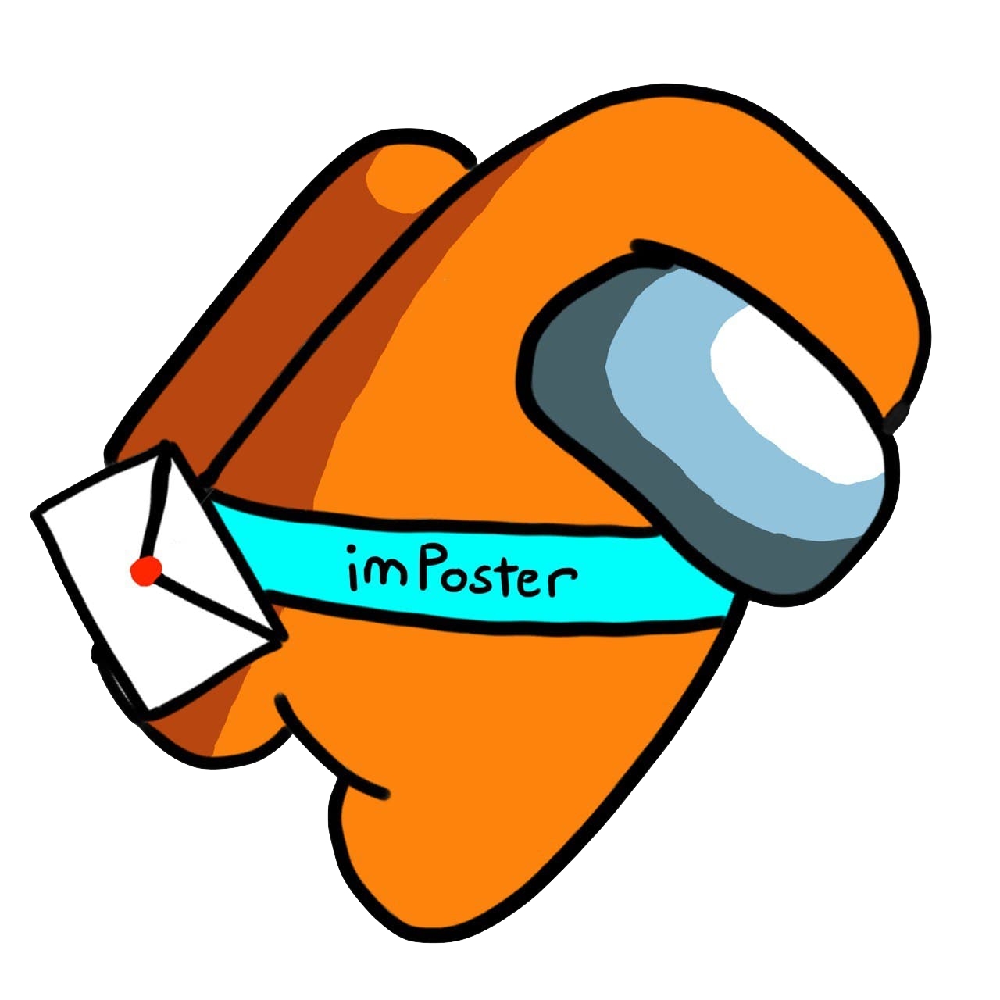

<p align="center">
  
  <h1 align="center">imPoster Website</h1>
</p>

## Table of Contents
* [Introduction](#introduction)
* [Features](#features)
* [Technologies](#technologies)
* [Team](#team)
* [Contributing](#contributing)
* [Others](#others)

### Introduction
imPoster Website forms part of the imPoster project whose objective is to produce a simple API testing tool for beginners/junior API developers. This repository contains the work done for our frontend. For the repository that contains our work on the product itself, please refer to the repository below:
```
https://github.com/AY2021S2-CS2103T-T12-4/tp
```
Currently, the project is live on the following website:
```
http://imposter-dev.tk/
```

### Features
For the full list of features of our product, please refer to the website with our [guides](https://ay2021s2-cs2103t-t12-4.github.io/tp/).

### Technologies
Technologies used by imPoster Website are as below:
##### Done with:

<p align="center">
  
</p>
<p align="center">
HTML
</p>
<p align="center">
  
</p>
<p align="center">
CSS
</p>
<p align="center">
  
</p>
<p align="center">
JavaScript
</p>

##### Deployed on:
<p align="center">
  
</p>
<p align="center">
OVHcloud
</p>

##### Project Repository
```
https://github.com/AY2021S2-CS2103T-T12-4/imposter_website
```

### Team
* [Juliet Teoh](https://github.com/julietteoh)
* [Liu Yongliang](https://github.com/tlylt)
* [Ong Jun Xiong](https://github.com/ong6)
* [Tan Jin](https://github.com/tjtanjin)
* [Warren Ng](https://github.com/nightraven49)

### Contributing
If you have code to contribute to the project, open a pull request and describe clearly the changes and what they are intended to do (enhancement, bug fixes etc). Alternatively, you may simply raise bugs or suggestions by opening an issue.

### Others
For any questions regarding the implementation of the project, please drop an email to: imposterdevteam@gmail.com.
